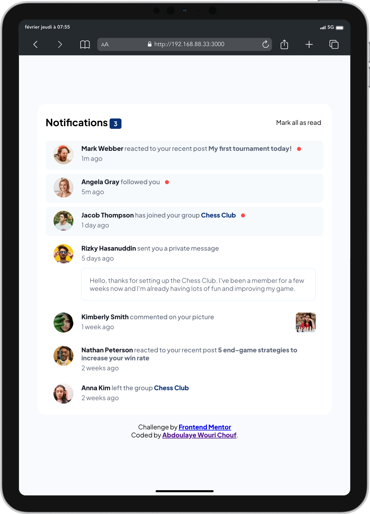

# Frontend Mentor - Notifications page solution

This is a solution to the [Notifications page challenge on Frontend Mentor](https://www.frontendmentor.io/challenges/notifications-page-DqK5QAmKbC). Frontend Mentor challenges.

## Table of contents

- [Frontend Mentor - Notifications page solution](#frontend-mentor---notifications-page-solution)
  - [Table of contents](#table-of-contents)
  - [Overview](#overview)
    - [The challenge](#the-challenge)
    - [Screenshot](#screenshot)
      - [Desktop viewer](#desktop-viewer)
      - [Tablet viewer](#tablet-viewer)
      - [Mobile viewer](#mobile-viewer)
    - [Links](#links)
  - [My process](#my-process)
    - [Built with](#built-with)
  - [Author](#author)

## Overview

### The challenge

Users should be able to:

- Distinguish between "unread" and "read" notifications
- Select "Mark all as read" to toggle the visual state of the unread notifications and set the number of unread messages to zero
- View the optimal layout for the interface depending on their device's screen size
- See hover and focus states for all interactive elements on the page

### Screenshot

#### Desktop viewer

#### Tablet viewer

#### Mobile viewer

### Links

- Solution URL: [GitHub Repository](https://github.com/Richouf95/notification-page)
- Live Site URL: [Live site](https://notification-page-khaki.vercel.app)

## My process

To carry out this project I
- Create a parent component `Notification`.
- Create a `NotificationHeader` component
- Create a `SingleNotification` component
- 
The parent component `Notification` has the `NotificationHeader` at the top and is followed by a map function which traverses an array of data and renders a `SingleNotification` for each element found.

### Built with

- [React](https://reactjs.org/) - JS library
- Mobile-first workflow
- Flexbox
- CSS custom properties

## Author

- GitHub - [Richouf95](https://github.com/Richouf95)
- Frontend Mentor - [@Richouf95](https://www.frontendmentor.io/profile/Richouf95)
- Linkedin - [@wourichouf](https://www.linkedin.com/in/wourichouf/)
